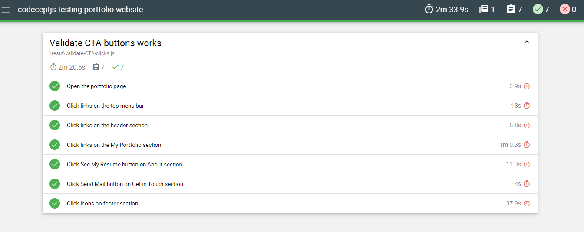

## A Codecept JS project to test my [My portfolio website](https://fulyaertay.netlify.app/) 

## Test Results
I tested my portfolio website to validate CTA button clicks using Codecept JS and Mochawesome Reporter

## Features
- I produced 7 scenarios to validate button clicks. Each section has own scenarios. These are; Menu bar, header or jumbotron, my projects, about, get in touch and footer sections. 
- You can reach all test cases on ./tests folder
- All test resulst are on the ./output/mochawesome.html file

## You can run tests using `npx codeceptjs run --reporter mochawesome` command.

